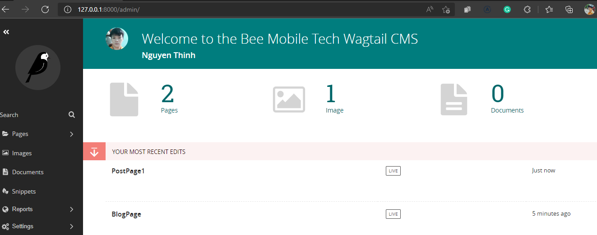

### Introduction
#### Build a modern blog with Wagtail CMS, Django, Webpack 5, Bootstrap 5, write DOM related code with vanilla JS.
___
### Tech Stack
- Python 3.10.4
- Django 3.2
- Wagtail 2.16
- Node.js 16
- Webpack 5
- Bootstrap 5.1
- Tribute.js
- Axios
- Postgres 14
### Project structure
1. Dockerfile is for docker deployment.
2. db.sqlite3 is a local db file (sqlite is used by default.)
3. home & search are Django apps created by Wagtail.
4. docker-compose.yml is a compose file to configure your app's services.
___
 

### References
- [Django's doc](https://docs.djangoproject.com/en/4.0)
- [Wagtail's doc](https://docs.wagtail.org/en/stable/)
- [Michael Yin - AccordBox](https://leanpub.com/u/michaelyin)
- [Vincent - LearnDjango](https://learndjango.com/)